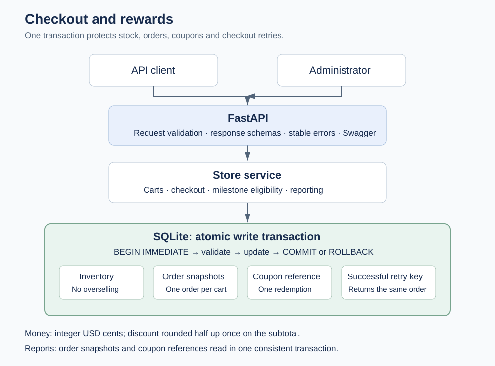

# Review the service in a few minutes



[Editable draw.io diagram](be/docs/architecture.drawio) · [Live Swagger UI](https://neustack-checkout-api.onrender.com/docs)

Open [the live Swagger UI](https://neustack-checkout-api.onrender.com/docs). Expand an endpoint, choose **Try it out**, enter the values below and select **Execute**. An idle free service may need time to wake up.

## 1. Inspect the catalog

Run **Products → GET /api/products**. There are five seeded products. Prices are USD cents: coffee at `1299` means $12.99. The grinder starts with only two units on a fresh database.

## 2. Create a cart and add coffee

Run **Carts → POST /api/carts** and copy the returned `id`.

Run **POST /api/carts/{cart_id}/items** using that ID and this body:

```json
{"product_id":"coffee","quantity":2}
```

With the seeded coffee price, the returned subtotal is `2598` cents. Stock is checked again at checkout; adding an item does not reserve it.

## 3. Place the order

Run **Checkout → POST /api/carts/{cart_id}/checkout** with the same cart ID. Set `Idempotency-Key` to a new value, such as `review-2026-10-08-01`, and use this body:

```json
{}
```

Expect **201** and an order containing the purchased names, prices, quantities and totals. Copy its `id` for **Orders → GET /api/orders/{order_id}**.

Use a fresh key for each new cart; successful keys are retained. If a reviewer has already used the example key, change its suffix.

## 4. Demonstrate safe retries

Execute the exact same checkout again, keeping the cart, body and key unchanged. Expect **200**, the same order ID and `Idempotency-Replayed: true`. No second order or additional stock reduction occurs.

Change only the key and retry the completed cart. Expect **409**, because a cart can produce only one order.

## 5. Inspect the report

Run **Administration → GET /api/admin/report**. Purchased quantities and totals come from committed order snapshots. Gross minus discounts equals net; available plus redeemed coupons equals generated coupons. Repeat the report request: it does not change state.

The public demo is shared, so its report may include earlier reviews. It resets when the free Render service restarts or redeploys.

## Optional: demonstrate rewards

After every five successful orders, **POST /api/admin/coupons** can issue one coupon for the oldest unrewarded milestone. Copy its code into checkout:

```json
{"coupon_code":"COPY_THE_GENERATED_CODE"}
```

A coupon can be used once. A failed checkout leaves it available. A 10% discount on a `1299`-cent subtotal rounds half up to `130` cents, giving a total of `1169` cents.

For a complete scripted example, follow [the hosted demo commands](DEPLOYMENT.md). The script creates five orders, issues a coupon, redeems it, checks a replay and prints the report.

## Where to inspect the design

- [HLD](be/docs/HLD.md): system boundaries and failure behavior.
- [LLD](be/docs/LLD.md): schema, constraints and checkout sequence diagrams.
- [Decisions](be/DECISIONS.md): alternatives and trade-offs.
- [Tests](be/tests/test_checkout.py): competing checkouts, rollback and retry recovery.
