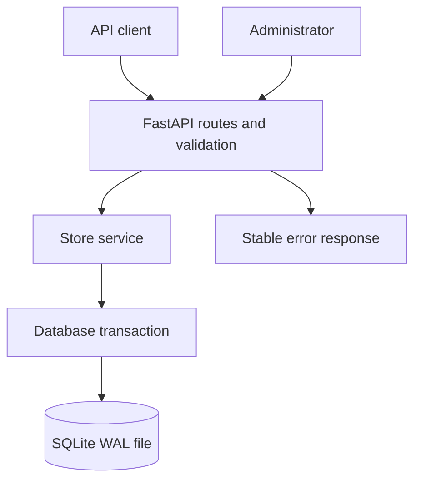

# High-level design

The service has one synchronous write boundary. FastAPI runs blocking handlers in its thread pool; each operation opens its own SQLite connection. There is no process-local lock or cache.

## Checkout boundary

The transaction begins before reading the retry key, cart, coupon or inventory. Success commits inventory reduction, the order snapshot and its retry record. Coupon redemption is represented by that order. Any failure rolls back the whole unit.

Only one SQLite writer can run at a time. This serializes checkout against cart edits, product changes and coupon generation, including writes from another local application process. WAL lets readers continue using a snapshot while that writer is active. Long write queues eventually produce `DATABASE_BUSY`; the design favors correctness over unbounded waiting.

## Reads and reporting

Cart reads show live catalog values. Order reads use immutable snapshots. Reports aggregate orders and join coupons in one read transaction, ensuring their counts describe the same database version. Read endpoints never issue coupons or repair state.

## Failure boundaries

| Event | Result |
| --- | --- |
| Response lost after commit | Same-key retry returns the stored order |
| Process exits before commit | SQLite recovery preserves the last committed state |
| Stock changes before checkout | Transaction sees the committed stock and may reject checkout |
| Another checkout wins a coupon | Loser receives a conflict without losing stock |
| Admin updates a product concurrently | Product change and checkout have a defined serialized order |
| Write lock cannot be acquired in time | 503 with retry guidance; no partial mutation |

## Multiple instances

For production, use PostgreSQL with row locks and database constraints, bounded connection pools and retries for serialization/deadlock failures. Keep transactions short. Use a reward ledger or serialized counter rather than assuming a global order count cannot race. Add an outbox only when there are actual asynchronous effects to deliver.

A real payment provider changes the workflow: reserve stock, authorize payment with a stable provider key, finalize the order and reward eligibility, then reconcile provider callbacks. The assignment treats a committed checkout as payment success.
