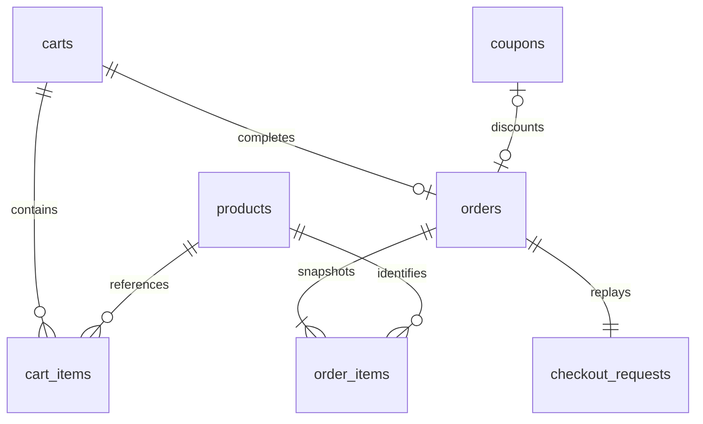

# Low-level design

## Data model



`reward_policy` is a singleton holding immutable campaign configuration. Coupon `milestone` is the absolute successful order threshold (5, 10, 15 for n=5), not the coupon count.

| Table | Key | Main constraints |
| --- | --- | --- |
| `products` | `id` | Integer bounded price and inventory |
| `carts` | `id` | Creation timestamp |
| `cart_items` | `(cart_id, product_id)` | Foreign keys; positive bounded quantity |
| `orders` | `id` | Unique cart and coupon; total equation; nonnegative discount |
| `order_items` | `(order_id, product_id)` | Frozen values; line-total equation |
| `coupons` | `code` | Unique positive milestone; 1–100 discount percentage |
| `checkout_requests` | `key` | Unique order; original cart and coupon payload |

Cart state is derived from the presence of its unique order; coupon state is derived from a referencing order. Avoiding duplicated status columns removes two possible sources of drift.

## Checkout sequence

1. Acquire `BEGIN IMMEDIATE` on a new connection.
2. Look up the idempotency key. Matching payload returns the original order; mismatch raises a conflict.
3. Require an existing, open, nonempty cart.
4. Resolve an optional coupon and require that no order references it.
5. Read current product prices and quantities. In product-ID order, decrement stock with `inventory >= requested` in the UPDATE predicate. If any update changes zero rows, raise and roll back earlier updates.
6. Calculate subtotal and half-up discount using integers.
7. Insert order header and frozen order lines. The coupon reference records redemption.
8. Insert the retry key and request identity.
9. Commit, then return the order. A first success is 201; replay is 200.

There are no application-level retries inside this operation. The caller receives a retryable 503 on lock timeout and can repeat the original request.

## Retry and failure flow

```mermaid
sequenceDiagram
    participant Client
    participant API as Checkout service
    participant DB as SQLite
    Client->>API: Checkout with retry key
    API->>DB: BEGIN IMMEDIATE
    API->>DB: Read retry key
    alt Successful request already stored
        DB-->>API: Original order
        API->>DB: Commit read-only write transaction
        API-->>Client: 200, same order
    else New checkout intent
        API->>DB: Validate cart, coupon and stock
        alt Validation or database operation fails
            API->>DB: ROLLBACK
            API-->>Client: Error, no committed changes
        else Checkout succeeds
            API->>DB: Update stock; insert order and retry record
            API->>DB: COMMIT
            API-->>Client: 201, order snapshot
        end
    end
```

## Milestone sequence

Within a write transaction, read committed order count and the largest issued milestone. The next eligible milestone is `largest + reward_every`. If it exceeds the order count, return 409. Otherwise insert a random UUID-based coupon code with that unique milestone. Transactions serialize this read-check-insert sequence.

## Read consistency

`Database.transaction(write=False)` explicitly starts a read transaction. The report's first SELECT establishes its snapshot; later order, quantity and coupon queries see the same version. Aggregation is not backed by mutable counters. `Store.report()` does not call coupon generation.

## Code ownership

- `schemas.py` validates the public input boundary and defines serialized output.
- `api.py` maps HTTP operations to service calls and sets replay status/headers.
- `service.py` owns business ordering and transaction participation.
- `database.py` owns commit, rollback, connection cleanup, foreign keys and lock errors.
- `errors.py` carries business error status, code and details without an HTTP dependency.

The service API is internal and assumes validated input; direct callers must honor that contract. Database CHECK and UNIQUE constraints still guard its most important persisted invariants.
